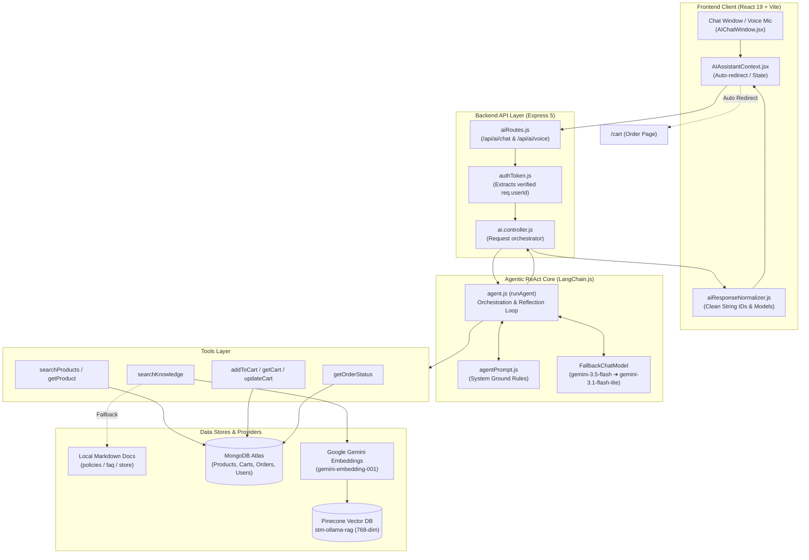
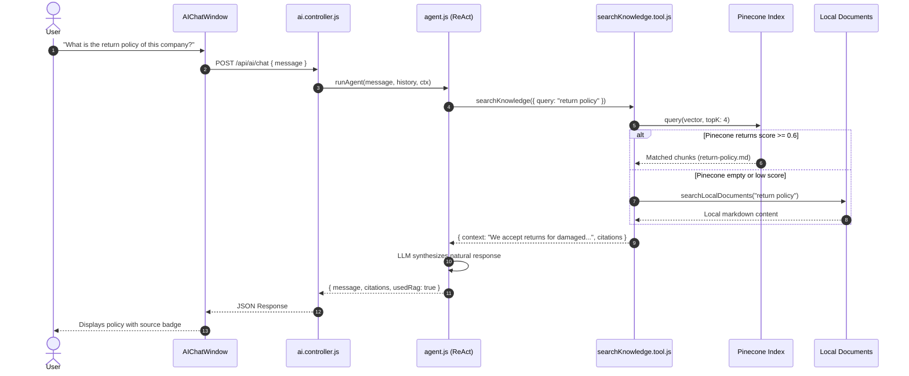
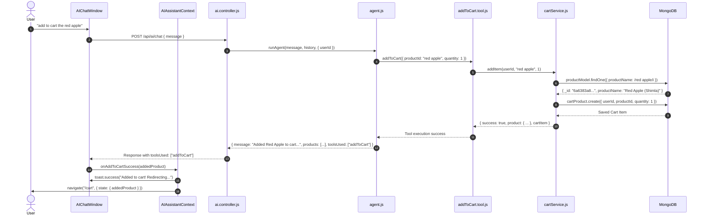
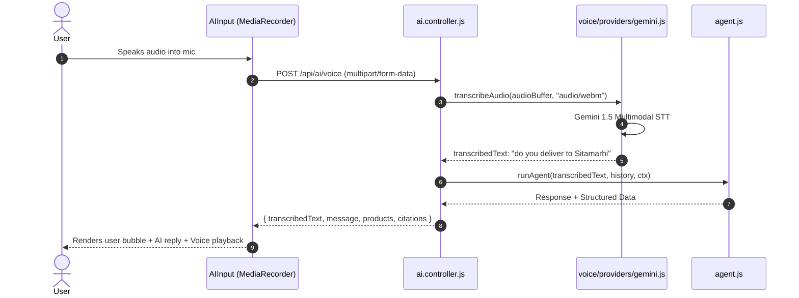

# STM AI Shopping Assistant & Agentic RAG Architecture

A production-grade, multi-model **Agentic RAG Shopping Assistant** engineered for the STM Fruit Shop MERN platform. It combines LangChain.js ReAct orchestration, Gemini LLMs with dynamic multi-tier fallback, Pinecone vector database semantic search, and direct MongoDB transactional tool execution.

---

## Table of Contents

1. [High-Level Architecture](#1-high-level-architecture)
2. [How the AI Agent and RAG Work Together](#2-how-the-ai-agent-and-rag-work-together)
3. [Component Breakdown: What File Does What](#3-component-breakdown-what-file-does-what)
   - [Agent Orchestration Layer (`ai-agent/src/agent/`)](#agent-orchestration-layer)
   - [LLM & Multi-Model Fallbacks (`ai-agent/src/llm/`)](#llm--multi-model-fallbacks)
   - [RAG & Vector Database (`ai-agent/src/rag/`)](#rag--vector-database)
   - [Tool Execution Layer (`ai-agent/src/tools/`)](#tool-execution-layer)
   - [Multimodal Voice Pipeline (`ai-agent/src/voice/`)](#multimodal-voice-pipeline)
   - [Backend Services & Controllers](#backend-services--controllers)
   - [Frontend UI & Context Layer (`my-app/src/`)](#frontend-ui--context-layer)
4. [End-to-End Execution Flows](#4-end-to-end-execution-flows)
   - [Flow A: Store Knowledge & Policies (RAG Flow)](#flow-a-store-knowledge--policies-rag-flow)
   - [Flow B: Add to Cart & Auto-Redirect (Agent Tool Flow)](#flow-b-add-to-cart--auto-redirect-agent-tool-flow)
   - [Flow C: Multimodal Voice Query Flow](#flow-c-multimodal-voice-query-flow)
5. [Security & Production Guardrails](#5-security--production-guardrails)

---

## 1. High-Level Architecture



---

## 2. How the AI Agent and RAG Work Together

The system divides user queries into **two clear categories** governed by `agentPrompt.js`:

```
                               User Prompt
                                   │
                ┌──────────────────┴──────────────────┐
                ▼                                     ▼
     Stable Store Knowledge                 Live / Transactional Data
 (Return policy, shipping, FAQs)       (Stock, pricing, cart, orders)
                │                                     │
         RAG RETRIEVER                            TOOL CALLS
   (Pinecone + Local Docs)                 (Mongoose Services Layer)
                │                                     │
   Returns verified context               Returns live database state
                │                                     │
                └──────────────────┬──────────────────┘
                                   ▼
                   LLM synthesizes final answer
                  + Returns structured product/cart
```

1. **RAG Retriever (Stable Knowledge)**:
   - Queries like *"what is the return policy of this company"* or *"do you deliver to Sitamarhi?"* are routed to `searchKnowledge`.
   - The query is embedded via `gemini-embedding-001` (768 dimensions) and queried against the **Pinecone index** (`stm-ollama-rag`).
   - If Pinecone is unreachable or returns below the similarity threshold, the retriever falls back to **Local Markdown Documents** (`documents/policies/`, `faq/`, `store/`).
   - Ground truth is passed back to the LLM context, preventing hallucinated policies.

2. **Transactional Agent Tools (Live Data)**:
   - Queries like *"add to cart the red apple"* or *"how much is Alphonso Mango?"* are executed through database tools (`searchProducts`, `addToCart`, `getCart`).
   - Tools **never trust user-provided user IDs**; they extract `ctx.userId` from the verified JWT cookie.
   - Prices, stock, and cart calculations are computed in MongoDB, not inside the LLM.

---

## 3. Component Breakdown: What File Does What

### Agent Orchestration Layer

| File Path | Description & Responsibility |
|---|---|
| [backend/ai-agent/src/agent/agent.js](file:///C:/Desktop/E%20commerce%20Website/E-Commerce-Website/backend/ai-agent/src/agent/agent.js) | The core **ReAct (Reason + Act)** loop. Builds LangChain messages, invokes the LLM with bound tools, executes tool calls, appends results, and extracts structured data (`products`, `cart`, `order`, `citations`, `toolsUsed`). |
| [backend/ai-agent/src/agent/agentPrompt.js](file:///C:/Desktop/E%20commerce%20Website/E-Commerce-Website/backend/ai-agent/src/agent/agentPrompt.js) | Defines the strict system instructions. Directs tool routing, specifies policy rules, and mandates proactive cart actions (e.g. searching and adding items immediately when requested). |
| [backend/ai-agent/src/agent/agentConfig.js](file:///C:/Desktop/E%20commerce%20Website/E-Commerce-Website/backend/ai-agent/src/agent/agentConfig.js) | Centralized timeouts, max iterations (guard against infinite loops), and message length constraints. |

---

### LLM & Multi-Model Fallbacks

| File Path | Description & Responsibility |
|---|---|
| [backend/ai-agent/src/llm/providers/gemini.js](file:///C:/Desktop/E%20commerce%20Website/E-Commerce-Website/backend/ai-agent/src/llm/providers/gemini.js) | Factory creating `ChatGoogleGenerativeAI` models. Uses `FallbackChatModel` wrapping primary (`gemini-3.5-flash`), secondary (`gemini-3.1-flash-lite`), tertiary (`gemini-3.5-flash-lite`), and baseline models to circumvent free-tier rate limits (429s). |
| [backend/ai-agent/src/llm/index.js](file:///C:/Desktop/E%20commerce%20Website/E-Commerce-Website/backend/ai-agent/src/llm/index.js) | Provider selector returning the active LLM instance based on `AI_PROVIDER` environment variable. |

---

### RAG & Vector Database

| File Path | Description & Responsibility |
|---|---|
| [backend/ai-agent/src/rag/embeddings.js](file:///C:/Desktop/E%20commerce%20Website/E-Commerce-Website/backend/ai-agent/src/rag/embeddings.js) | Configures Google's `gemini-embedding-001` with `outputDimensionality: 768` matching the Pinecone index specification. |
| [backend/ai-agent/src/rag/vectorStore.js](file:///C:/Desktop/E%20commerce%20Website/E-Commerce-Website/backend/ai-agent/src/rag/vectorStore.js) | Manages the Pinecone client connection and index binding. |
| [backend/ai-agent/src/rag/retriever.js](file:///C:/Desktop/E%20commerce%20Website/E-Commerce-Website/backend/ai-agent/src/rag/retriever.js) | Executes vector similarity queries against Pinecone. Contains local document scanning fallback for markdown files in `documents/`. |
| [backend/ai-agent/src/rag/ingestion.js](file:///C:/Desktop/E%20commerce%20Website/E-Commerce-Website/backend/ai-agent/src/rag/ingestion.js) | The data pipeline script. Reads markdown policy files, fetches all active products, categories, cities, and settings from MongoDB, sanitizes metadata, and upserts them to Pinecone. |
| `backend/ai-agent/src/rag/documents/` | Source documents for store knowledge: `policies/return-policy.md`, `shipping-policy.md`, `faq/general-faq.md`, `store/store-info.md`. |

---

### Tool Execution Layer

| File Path | Description & Responsibility |
|---|---|
| [backend/ai-agent/src/tools/schemas.js](file:///C:/Desktop/E%20commerce%20Website/E-Commerce-Website/backend/ai-agent/src/tools/schemas.js) | Zod schemas defining tool parameters exposed to the LLM for function calling. |
| [backend/ai-agent/src/tools/searchKnowledge.tool.js](file:///C:/Desktop/E%20commerce%20Website/E-Commerce-Website/backend/ai-agent/src/tools/searchKnowledge.tool.js) | Wraps `retriever.js` to provide store policy and FAQ context to the agent. |
| [backend/ai-agent/src/tools/searchProducts.tool.js](file:///C:/Desktop/E%20commerce%20Website/E-Commerce-Website/backend/ai-agent/src/tools/searchProducts.tool.js) | Searches products in MongoDB by query string, category, and price range. |
| [backend/ai-agent/src/tools/getProduct.tool.js](file:///C:/Desktop/E%20commerce%20Website/E-Commerce-Website/backend/ai-agent/src/tools/getProduct.tool.js) | Fetches complete product details by ID. |
| [backend/ai-agent/src/tools/addToCart.tool.js](file:///C:/Desktop/E%20commerce%20Website/E-Commerce-Website/backend/ai-agent/src/tools/addToCart.tool.js) | Adds a product to the authenticated user's cart and returns updated cart item details. |
| [backend/ai-agent/src/tools/getCart.tool.js](file:///C:/Desktop/E%20commerce%20Website/E-Commerce-Website/backend/ai-agent/src/tools/getCart.tool.js) | Retrieves the current user's cart items and total. |
| [backend/ai-agent/src/tools/updateCartQuantity.tool.js](file:///C:/Desktop/E%20commerce%20Website/E-Commerce-Website/backend/ai-agent/src/tools/updateCartQuantity.tool.js) | Modifies quantity of an existing cart item. |
| [backend/ai-agent/src/tools/removeFromCart.tool.js](file:///C:/Desktop/E%20commerce%20Website/E-Commerce-Website/backend/ai-agent/src/tools/removeFromCart.tool.js) | Deletes an item from the user's cart. |
| [backend/ai-agent/src/tools/getOrderStatus.tool.js](file:///C:/Desktop/E%20commerce%20Website/E-Commerce-Website/backend/ai-agent/src/tools/getOrderStatus.tool.js) | Looks up recent or specific order tracking status from MongoDB. |

---

### Multimodal Voice Pipeline

| File Path | Description & Responsibility |
|---|---|
| [backend/ai-agent/src/voice/providers/gemini.js](file:///C:/Desktop/E%20commerce%20Website/E-Commerce-Website/backend/ai-agent/src/voice/providers/gemini.js) | Server-side speech-to-text (STT) provider using Gemini 1.5/2.0 multimodal audio processing to transcribe voice input. |
| [backend/ai-agent/src/voice/providers/whisper.js](file:///C:/Desktop/E%20commerce%20Website/E-Commerce-Website/backend/ai-agent/src/voice/providers/whisper.js) | Optional OpenAI Whisper STT fallback provider. |
| [backend/ai-agent/src/voice/index.js](file:///C:/Desktop/E%20commerce%20Website/E-Commerce-Website/backend/ai-agent/src/voice/index.js) | Factory resolving the configured STT provider. |

---

### Backend Services & Controllers

| File Path | Description & Responsibility |
|---|---|
| [backend/controller/ai.controller.js](file:///C:/Desktop/E%20commerce%20Website/E-Commerce-Website/backend/controller/ai.controller.js) | Express controller for `POST /api/ai/chat` and `POST /api/ai/voice`. Coordinates authentication, rate limits, audio upload, agent execution, and response serialization. |
| [backend/routes/aiRoutes.js](file:///C:/Desktop/E%20commerce%20Website/E-Commerce-Website/backend/routes/aiRoutes.js) | Declares AI endpoints protected by `authToken` and `aiRateLimit`. |
| [backend/services/cartService.js](file:///C:/Desktop/E%20commerce%20Website/E-Commerce-Website/backend/services/cartService.js) | Cart data access layer. Resolves items by ObjectId or name regex fallback, enforces user ownership, and updates quantities. |
| [backend/services/productService.js](file:///C:/Desktop/E%20commerce%20Website/E-Commerce-Website/backend/services/productService.js) | Product query service. Returns clean 24-character string IDs and sanitizes fields for AI consumption. |
| [backend/services/orderService.js](file:///C:/Desktop/E%20commerce%20Website/E-Commerce-Website/backend/services/orderService.js) | Order tracking service restricted to the authenticated user's orders. |
| [backend/controller/user/addTocartController.js](file:///C:/Desktop/E%20commerce%20Website/E-Commerce-Website/backend/controller/user/addTocartController.js) | Standard web cart controller. Handles add to cart from both manual UI clicks and AI cards. |

---

### Frontend UI & Context Layer

| File Path | Description & Responsibility |
|---|---|
| [my-app/src/context/AIAssistantContext.jsx](file:///C:/Desktop/E%20commerce%20Website/E-Commerce-Website/my-app/src/context/AIAssistantContext.jsx) | Global state provider for the AI assistant. Handles window open/close, mobile view adjustments, and **auto-redirection to `/cart`** on add to cart. |
| [my-app/src/hooks/ai/useAIAssistant.js](file:///C:/Desktop/E%20commerce%20Website/E-Commerce-Website/my-app/src/hooks/ai/useAIAssistant.js) | Core React hook managing message histories, streaming states, and `onAddToCartSuccess` hooks. |
| [my-app/src/utils/ai/aiResponseNormalizer.js](file:///C:/Desktop/E%20commerce%20Website/E-Commerce-Website/my-app/src/utils/ai/aiResponseNormalizer.js) | Sanitizes backend responses into UI models. Enforces clean string IDs to prevent `[object Object]` React key bugs and CastErrors. |
| [my-app/src/components/ai-assistant/ProductResultCard.jsx](file:///C:/Desktop/E%20commerce%20Website/E-Commerce-Website/my-app/src/components/ai-assistant/ProductResultCard.jsx) | Interactive product card inside the chat with "Add to Cart" button that redirects to `/cart`. |
| [my-app/src/components/ai-assistant/ProductResultList.jsx](file:///C:/Desktop/E%20commerce%20Website/E-Commerce-Website/my-app/src/components/ai-assistant/ProductResultList.jsx) | Scrollable carousel rendering product cards with unique keys. |
| [my-app/src/components/ai-assistant/CartResult.jsx](file:///C:/Desktop/E%20commerce%20Website/E-Commerce-Website/my-app/src/components/ai-assistant/CartResult.jsx) | Compact cart view rendered in chat with direct links to checkout. |
| [my-app/src/components/ai-assistant/AIInput.jsx](file:///C:/Desktop/E%20commerce%20Website/E-Commerce-Website/my-app/src/components/ai-assistant/AIInput.jsx) | Combined text and voice recording input bar. |

---

## 4. End-to-End Execution Flows

### Flow A: Store Knowledge & Policies (RAG Flow)



---

### Flow B: Add to Cart & Auto-Redirect (Agent Tool Flow)



---

### Flow C: Multimodal Voice Query Flow



---

## 5. Security & Production Guardrails

1. **Strict User Isolation**: `ctx.userId` is populated strictly from the authenticated JWT session verified by Express middleware. No tool accepts `userId` as an argument from the LLM prompt.
2. **Resilient Rate Limits**: `aiRateLimit.js` protects AI endpoints (e.g. max 20 requests per minute per IP/user) against API abuse.
3. **Dual-Layer Multi-Model Fallbacks**: Free-tier Gemini quotas (429s) automatically cascade down: `gemini-3.5-flash` ➔ `gemini-3.1-flash-lite` ➔ `gemini-3.5-flash-lite` ➔ `gemini-flash-latest`.
4. **Pinecone & Local Markdown Hybrid RAG**: Critical policy inquiries always return verified store policy data even during Pinecone vector database cold starts or index redeployments.
5. **No Hallucinated Data**: Product prices, stock availability, cart counts, and orders are fetched directly from MongoDB and serialized as structured fields, never parsed from model-generated markdown.
